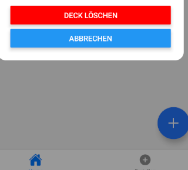

# Tag 06 – Modal, Farbauswahl & Styles

## Screenshots

## Was gemacht wurde

Heute habe ich drei von fünf geplanten Aufgaben gelöst. Die restlichen zwei Aufgaben konnte ich nicht abschliessen, da ich das Team unterstützt habe, das für den CSS- und HTML-Kurs in den Ferien zuständig ist.

Die drei erledigten Aufgaben betrafen die Dateien `create.tsx`, `index.tsx`, `DeckOptionsModal.tsx` und `styles.ts`.

In `create.tsx` habe ich die Farbliste `DECK_COLORS` auf die fünf vorgegebenen Farben angepasst: Gelb, Hellgrün, Hellblau, Rosa und Lachs. Die Funktion `getRandomColor()` sowie das Speichern der Farbe im Deck-Objekt über `AsyncStorage` waren bereits korrekt implementiert und mussten nicht verändert werden.

In `index.tsx` habe ich das bestehende `handleLongPress`-Verhalten durch ein Modal-System ersetzt. Dazu habe ich zwei neue States angelegt: `modalVisible` steuert die Sichtbarkeit des Modals und `selectedDeck` speichert das aktuell ausgewählte Deck. Beim langen Drücken auf ein Deck öffnet sich das Modal. Darin kann der Benutzer den Titel umbenennen, eine neue Farbe auswählen oder das Deck löschen. Alle Änderungen werden mit `map()` bzw. `filter()` im lokalen State aktualisiert und gleichzeitig in `AsyncStorage` gespeichert. Das Löschen wird zusätzlich mit einem `Alert.alert()` bestätigt. Die Modal-Logik wurde als separate Komponente `DeckOptionsModal` ausgelagert und in `index.tsx` importiert.

In `DeckOptionsModal.tsx` habe ich die Komponente erstellt, die das Modal-Fenster mit allen drei Optionen enthält. Zunächst war das gesamte Styling als Inline-Styles geschrieben. In einem zweiten Schritt habe ich die Inline-Styles durch Referenzen auf `styles.ts` ersetzt, nachdem dort die neuen Styles ergänzt wurden.

In `styles.ts` habe ich neue Style-Regeln hinzugefügt, ohne bestehende zu verändern. Neu dazugekommen sind `overlay` und `modal` für das Modal-Grundlayout, `title` und `subtitle` für Textelemente sowie `modalInput` für das Eingabefeld, `colorRow` für die horizontale Farbreihe und `colorCircle` für die einzelnen Farbkreise.

## Herausforderungen

Bei der Auslagerung in eine separate Komponente war es wichtig, alle benötigten Funktionen und States als Props weiterzugeben, da die Komponente selbst keinen eigenen Zustand verwaltet. Ausserdem musste ich darauf achten, dass der Import von `styles` in `DeckOptionsModal.tsx` korrekt eingebunden ist, damit keine ungenutzten Variablen-Warnungen entstehen.

## Fazit

Heute habe ich gelernt, wie man ein Modal in React Native mit einer separaten Komponente umsetzt und wie man Styles zentral in einer `styles.ts`-Datei verwaltet, anstatt sie als Inline-Styles zu schreiben. Ausserdem habe ich verstanden, wie Props genutzt werden, um Zustände und Funktionen zwischen Komponenten weiterzugeben.
