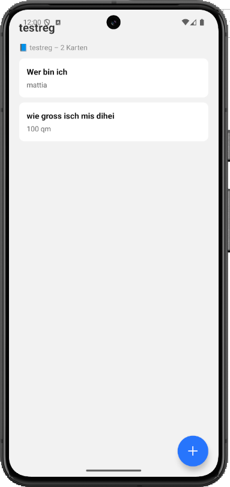

# Tag 07 – Deck-Detailseite & Card-Verwaltung

## Screenshots

## Was gemacht wurde

Heute habe ich die restlichen zwei Aufgaben von gestern abgeschlossen, die ich nicht fertigstellen konnte, weil ich das Team unterstützt habe, das für den CSS- und HTML-Kurs in den Ferien zuständig ist.

Die zwei erledigten Aufgaben betrafen die Datei `[deckId].tsx`.

In einem ersten Schritt habe ich die Detailseite so angepasst, dass der Titel des gewählten Decks dynamisch aus dem Speicher geladen und angezeigt wird. Die `deckId` wird mit `useLocalSearchParams()` aus der URL ausgelesen, anschliessend werden alle Decks aus `AsyncStorage` geladen und das passende Deck anhand der ID gesucht. Während des Ladens wird ein `ActivityIndicator` angezeigt, bei fehlendem Deck die Meldung „Deck nicht gefunden".

In einem zweiten Schritt habe ich das Löschen einzelner Cards per LongPress umgesetzt. Im `renderItem` der `FlatList` wurde die bisherige `View`-Komponente durch eine `TouchableOpacity` mit `onLongPress` ersetzt. Bei einem langen Drücken erscheint ein `Alert.alert()` zur Bestätigung. Bei Bestätigung wird die Card mit `filter()` entfernt, der State aktualisiert und das Deck in `AsyncStorage` gespeichert. Oberhalb der Liste wird zudem eine Info-Zeile angezeigt, z. B. „📘 Mathe – 4 Karten".

## Herausforderungen

Beim Löschen der Cards war es wichtig, sowohl den `cards`-State als auch den `deck` State gleichzeitig zu aktualisieren, damit die Kartenanzahl in der Info-Zeile sofort korrekt angezeigt wird.

## Fazit

Heute habe ich gelernt, wie man URL-Parameter mit `useLocalSearchParams()` ausliest und darauf basierend Daten aus `AsyncStorage` lädt. Ausserdem habe ich verstanden, wie man mit `onLongPress` und `Alert.alert()` eine durch einen Bestätigungsdialog abgesicherte Löschfunktion umsetzt.
